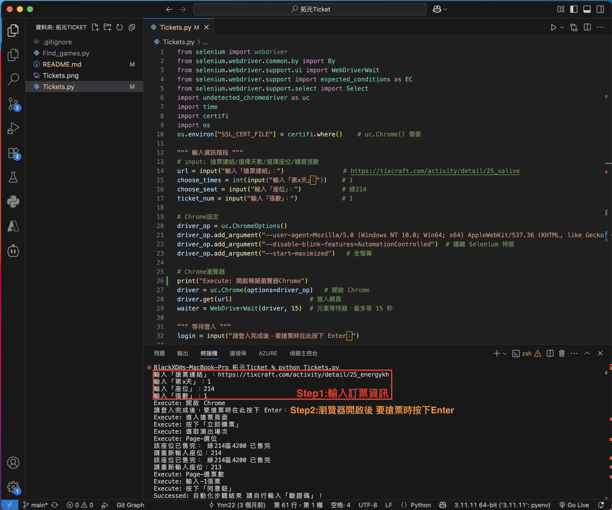

# 拓元搶票輔助神器 - Tickets
###### Tags: `拓元搶票`/ `tixcraft` / `自動化操作`

⚠️ 警告：請勿將本程式用於非法用途，否則後果自負！

## 必備軟體
* Python 3 （建議使用 Python 3.9以上）

## 安裝流程

* **Step1：** 按下「右上方Code」→ 「Download ZIP」→ 並解壓縮
* **Step2：** 打開「終端機」 → 並輸入以下2行
    1. `pip install --upgrade selenium`
    2. `pip install --upgrade undetected_chromedriver`
* **Step3：** 打開解壓縮的「資料夾」 → 找到「Tickets.py」並打開
* **Step4：** 即可開始使用「Tickets」！

❗️ 也可以使用 `git clone https://github.com/Ynn622/Tickets.git` 安裝
## 使用方法
* **Step1：** 執行「Tickets.py」
* **Step2：** 依序輸入「搶票連結 / 選擇天數 / 選擇座位 / 購買張數」
* **Step3：** 等待Chrome開啟後，先登入好帳號
* **Step4：** 要搶票時 在「Tickets.py」的終端頁面按下 <kbd>Enter</kbd>
* **Step5：** 開始自動化輸入「搶票資訊」！
* **Step6：** 等進入「驗證碼頁面」後，請自行完成後續訂票流程！

## 問題反應
如有任何問題，歡迎至 [Issue](https://github.com/Ynn622/Tickets/issues) 頁面回饋～